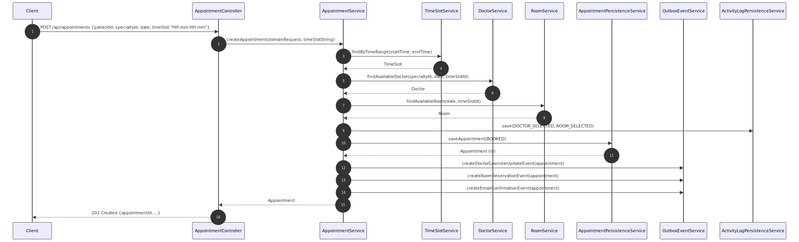
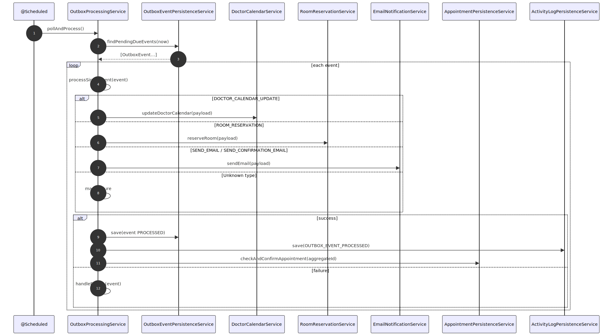

## Uphill - Healthcare Appointment System

A Spring Boot application for managing healthcare appointments with doctors, rooms, and time slots. Built with clean architecture, it handles appointment booking, confirmation workflows, and integrates with external services.

## Quick Start

**Prerequisites:** Java 21, Docker & Docker Compose

### Development (Local)
```bash
make dev
./mvnw spring-boot:run -Dspring.profiles.active=local
```
API: http://localhost:8080

### Docker (Full)
```bash
make run
```
API: http://localhost:8080

**Commands:**
- `make logs` - view logs
- `make down` - stop services  
- `make unit-test` - run tests

### What This System Does

This is a healthcare appointment booking system that lets patients book appointments with doctors. Here's how it works:

- **Appointment Booking**: Patients can book appointments with doctors in aspecific time slot
- **Background Processing**: When an appointment is created, the system handles confirmation steps (updating doctor calendars, reserving rooms, sending emails) in the background
- **Activity Tracking**: Everything gets logged for audit purposes
- **Security**: Uses JWT tokens for authentication, with some endpoints public for booking
- **Data Storage**: PostgreSQL for main data, Redis for caching and preventing duplicate requests

### High-Level Architecture



### Main Components

**Appointment Management**
- `AppointmentService`: Handles the booking flow, checks availability, and queues background tasks
- `AppointmentPersistenceService`: Saves and updates appointment data

**Background Processing (Outbox Pattern)**
- `OutboxEventService`: Creates background tasks when appointments are made
- `OutboxProcessingService`: Runs every 30 seconds to process these tasks (update doctor calendars, reserve rooms, send emails)

**Activity Logging**
- `ActivityLogPersistenceService`: Keeps track of what happened for audit trails

**API Endpoints**
- `AppointmentController`: Create and list appointments
- `AuthController`: Login/logout for admins
- `GlobalExceptionHandler`: Handles errors consistently

**Data Layer**
- JPA entities for database tables
- Spring Data repositories for database queries
- MapStruct for converting between database and domain objects

**Security**
- JWT authentication for admin endpoints
- Idempotency filter to prevent duplicate appointment requests

### Key Class Diagram



### Sequence Diagram: Create Appointment



### Sequence Diagram: Outbox Processing



### Flowchart: Appointment Booking



### Lifecycle: Appointment Status



### API Endpoints

**Public Endpoints**
- `POST /api/appointments` - Book an appointment (no auth required)
  - Send: patientId, specialty, date, time slot
  - Get back: appointment details

**Admin Endpoints** (requires JWT token)
- `GET /api/appointments` - List all appointments with filters
- `POST /api/auth/login` - Get admin JWT token

All responses follow the same format with success/error status.

### Database Structure

**Main Tables**
- `appointments` - The core booking data
- `patients`, `doctors`, `rooms` - Basic entities
- `time_slots` - Available appointment times
- `outbox_events` - Background tasks waiting to be processed
- `activity_logs` - Audit trail of what happened

**Database Features**
- Flyway migrations handle schema changes
- Custom queries for filtering appointments
- MapStruct automatically converts between database and Java objects

**Test Data Seeding**
- **Development**: Includes sample doctors, patients, rooms, and time slots
- **Production**: Clean database with no test data
- **Testing**: Consistent test data for reliable tests

### How Background Processing Works

When someone books an appointment, the system doesn't immediately confirm it. Instead:

1. **Create Tasks**: The system creates background tasks for:
   - Updating the doctor's calendar
   - Reserving the room
   - Sending confirmation emails

2. **Process Tasks**: Every 30 seconds, a background job runs and:
   - Picks up pending tasks
   - Calls external services (doctor calendar, room reservation, email)
   - If successful: marks task as done and logs the activity
   - If failed: retries later with exponential backoff

3. **Confirm Appointment**: Once all tasks succeed, the appointment gets confirmed

### Security Setup

**Public Access**
- Anyone can book appointments (`POST /api/appointments`)
- Health check endpoints are public

**Admin Access**
- List appointments, login endpoints require JWT token
- Tokens are stateless and contain admin role
- Method-level security protects admin functions

### Preventing Duplicate Bookings

To stop people from accidentally booking the same appointment twice:

- Send an `Idempotency-Key` header with your booking request
- The system remembers this key in Redis
- If you send the same key again, you get the same response (no duplicate booking)
- Keys expire after 24 hours

### Configuration Profiles

**Local Development** (`local`)
- Uses local PostgreSQL and Redis
- Auto-creates database tables
- **Includes test data seeding** (doctors, patients, rooms, time slots)
- External services point to localhost

**Docker** (`docker`)
- Uses environment variables for database/Redis connections
- External services configured via environment
- **No test data seeding** (clean production-like environment)

**Testing** (`test`)
- Uses in-memory H2 database
- **Includes test data seeding** for consistent test data
- Debug logging enabled

### Running with Docker

**What's Included**
- PostgreSQL 16 database
- Redis 7 for caching
- The main application
- Mock external services (Node.js) for testing

**Health Checks**
- Database and Redis have health checks
- Application exposes health endpoints
- Everything starts up in the right order

### Deployment Pipeline

**Jenkins Pipeline**
- Takes parameters for AWS region, image tag, and instance count
- Builds the application and deploys to AWS
- Archives deployment scripts for later use

### Current Limitations

**Scheduling Constraints**
- Appointments must use predefined time slots (no custom durations)
- Timezone handling isn't fully implemented
- No double-booking protection beyond basic slot checking

**Security & Reliability**
- Only appointment booking is protected against duplicates
- No rate limiting on public endpoints
- Background tasks retry but don't have advanced failure handling
- Email success is assumed (no bounce tracking)

**External Dependencies**
- External services must handle duplicate calls (idempotent)
- No monitoring of external service health

### Development Setup

**Database Options**
- Use Docker Compose for PostgreSQL and Redis
- Or run them locally if you prefer

**Configuration**
- `local` profile: Auto-creates tables, uses localhost services
- `docker` profile: Uses environment variables for connections
- Background processing starts automatically

### Generating Diagrams

If you want to update the architecture diagrams:

```bash
make docs-diagrams
```

This creates SVG files in `docs/diagrams/` that show the system architecture, class relationships, and process flows.

### Potential Improvements

**1. Replace Background Scheduler with Temporal**

For processing outbox events and handling retries, the system uses a Spring scheduler to periodically scan and dispatch pending events.
This approach was chosen to showcase core framework capabilities and implementation skills, while keeping the infrastructure simple and fully within the Spring ecosystem.
However, in a production environment, using a workflow engine such as Temporal would be the preferred approach. Temporal provides built-in durability, fault tolerance, and workflow visibility, making it more suitable for complex or long-running background processes.

- **Current**: `@Scheduled` polling with `OutboxProcessingService` (137 lines of complex retry logic)
- **Suggestion**: Migrate to [Temporal.io](https://temporal.io/) for robust workflow orchestration
- **Impact**: High - Eliminates polling overhead, provides built-in retry policies, visual workflow monitoring, and better reliability
- **Implementation**: 
  - **Remove**: `@Scheduled` polling, manual retry logic, outbox event persistence
  - **Add**: Simple worker that registers existing services as Temporal activities
  - **Result**: Your existing `DoctorCalendarService`, `RoomReservationService`, `EmailNotificationService` become Temporal activities with automatic retries and monitoring
- **Pseudo Code**:
  ```java
  // 1. Define what work to do (Activity)
  @ActivityInterface
  public interface AppointmentActivity {
      void updateDoctorCalendar(AppointmentEventPayload payload);
      void reserveRoom(AppointmentEventPayload payload);
      void sendEmail(AppointmentEventPayload payload);
  }
  
  // 2. Implement the work (wrap your existing services)
  @Component
  public class AppointmentActivityImpl implements AppointmentActivity {
      private final DoctorCalendarService doctorCalendarService;
      private final RoomReservationService roomReservationService;
      private final EmailNotificationService emailNotificationService;
      
      @Override
      public void updateDoctorCalendar(AppointmentEventPayload payload) {
          doctorCalendarService.updateDoctorCalendar(payload);
      }
      // ... other methods
  }
  
  // 3. Start worker (one-time setup)
  @Component
  public class TemporalWorker {
      @PostConstruct
      public void startWorker() {
          Worker worker = factory.newWorker("appointment-task-queue");
          worker.registerActivitiesImplementations(new AppointmentActivityImpl(...));
          factory.start();
      }
  }
  
  // 4. Trigger work (replace outbox creation)
  public void createAppointment() {
      AppointmentWorkflow workflow = workflowClient.newWorkflowStub(AppointmentWorkflow.class);
      WorkflowClient.start(workflow::processAppointment, appointmentId, payload);
  }
  ```

**2. Event-Driven Architecture**
- **Current**: Polling every 30 seconds to process background tasks
- **Better**: Use Kafka or AWS EventBridge for real-time event processing
- **Why**: Faster processing, better scalability, easier to add new features

**3. Better Monitoring**
- **Current**: Basic health checks and logs
- **Better**: Prometheus metrics, Grafana dashboards, structured logging
- **Why**: Catch problems before users notice, understand system performance

**4. Smart Caching**
- **Current**: Redis only used to prevent duplicate bookings
- **Better**: Cache doctors, rooms, time slots to reduce database load
- **Why**: Faster response times, less database pressure

**5. API Security & Rate Limiting**
- **Current**: No protection against abuse, basic JWT auth
- **Better**: Rate limiting, OAuth 2.0, API versioning
- **Why**: Prevent abuse, better security, easier API management

### Key Files

**Main Application**
- `UphillApplication.java` - Application startup and configuration
- `AppointmentService.java` - Core booking logic
- `OutboxProcessingService.java` - Background task processor

**API Layer**
- `AppointmentController.java` - REST endpoints
- `JwtAuthenticationFilter.java` - Authentication
- `IdempotencyFilter.java` - Duplicate request prevention

**Infrastructure**
- `docker-compose.yml` - Local development setup
- `Dockerfile` - Application container
- `Jenkinsfile` - Deployment pipeline


